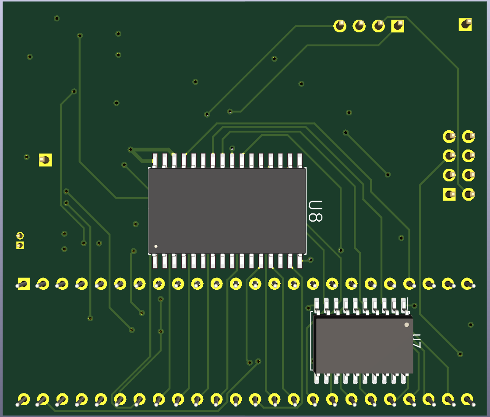
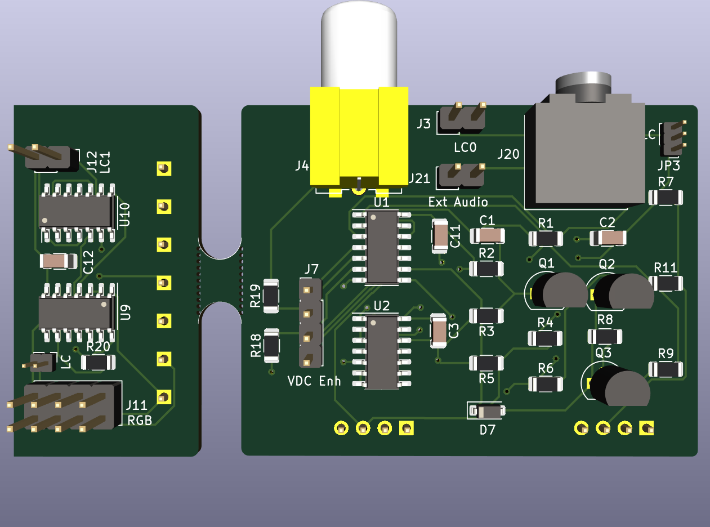

## R2V2 - Dual-video switcher & converter for the Commodore 128

This is an open-source project that aims to improve the quality, flexibility, and convenience of the dual-video outputs of the Commodore 128.

In the normal configuration, the C128 has two independent video outputs for the VDC (80-column mode) and the VIC-II (40-column mode) displays. Each display requires its own cable going to its own specific type of monitor input, with the ideal being RGBI input for the 80col display and S-video for the 40col display. You can use two monitors, or you can use a retro monitor (e.g. Commodore 1084) that is manually switchable between two inputs.

With R2V2 installed in a C128, a single port, cable, and monitor input is used for BOTH display modes AND the display mode is switchable using the keyboard or with software control. If you also have the [idun-cartridge](https://github.com/idun-project/idun-cartridge), its software will be able to switch the displays automatically.

### Components

R2V2 requires two small PCBs installed internally. One sits under the VDC chip, and can optionally include 64KB video RAM expanasion. There are versions for the MOS8563 and the MOS8568 (for C128-DCR). The second PCB installed is from the breakable PCB pictured and is either:

1. An RF modulator replacment, which enhances the 8-pin DIN monitor port plus adds composite monitor and stereo audio outputs (supports 2 SIDs). It can also support switchable **HDMI OUT** from the composite port! (Requires additional compoents)
2. A modification for the DB-9 monitor port, which outpus analog RGB (rather than RGBI) and can also be used for switchable **HDMI OUT**.

### Status

This is an open-source project still in the R&D phase. It is not fully baked, and you should not try to build it _unless you want to contribute to the testing/debugging effort_.

- [*] Prototype PCBs manufactured
    - [*] MOS8568 VDC enhancer
    - [*] MOS8563 VDC enhancer
    - [*] analog board
- [ ] Prototype PCBs assembled
    - [ ] MOS8568 VDC enhancer
    - [ ] MOS8563 VDC enhancer w/o SRAM
    - [ ] MOS8563 VDC enhancer w/ SRAM
    - [ ] RF modulator replacement
    - [ ] DB-9 mod
- [ ] Testing
    - [ ] MOS8568+RF mod S-vid, composite, audio
    - [ ] MOS8563+RF mod S-vid, composite, audio
    - [ ] MOS8563+SRAM
    - [ ] MOS8563+RF mod LumaCode, mono-80c to RGBtoHDMI
    - [ ] MOS8568+DB-9 mod analog RGB
    - [ ] MOS8568+DB-9 mod LumaCode, color-80c to RGBtoHDMI
    - [ ] MOS8563+DB-9 mod LumaCode, color-80c to RGBtoHDMI

### Configurations

Many different configurations are possible, and depends on the kind of monitor you want to use, be it a retro CRT, modern monitor with analog input, or HDMI.

#### For analog monitor inputs

If you intend to use a monitor that supports S-video, you should be able to get good quality color output for both 80col and 40col display modes. Install the VDC enhancer compatible to your system and the RF modulator replacement, then connect the DIN monitor port to your display. You can use the audio on the DIN port, or plug in to the 3.5mm headphone jack.

If you intend to use a monitor that supports composite, you can get decent color 40col and monochrome 80col from the output on the RCA jack. Install the VDC enhancer and the RF modulator replacement, then connect the composite output to your display. Most likely, you will want to use the 3.5mm heahphone jack for audio.

It is possible to install both the RF modulator replacment and the DB-9 mod. If you do this, then you'll have analog RGB (both RGBS and RGBHV) on the DB-9, and that might be what you want for some monitors (e.g. SCART input). You'll have to work out your own switching between displays using this configuration.

#### For digital HDMI monitors

For the absolute best picture quality on modern displays, the R2V2 is combined with the [VIC-II LumaCode](https://github.com/c0pperdragon/LumaCode/wiki/VICIIdizer128-(for-the-C128)) enhancement and an external [RGBtoHDMI](https://github.com/hoglet67/RGBtoHDMI/wiki) video converter/upscaler.

There is a simpler version of the RGBtoHDMI designed by "C0pperdragon" that handles only LumaCode and monochrome video. This version can be used with the composite output on the RF modulator replacement. You will get color 40col and monochrome 80col display modes from a single HDMI input.

If you want the best HDMI experience with color 80col, then you'll need the more sophisticated RGBtoHDMI converter that handles both LumaCode and RGBS. This version connects with a custom cable to the DB-9 port and uses LumaCode for 40col mode and RGBS for 80col mode.

_NOTE_: A firmware patch and profile for the RGBtoHDMI is being developed so that it will automatically switch display modes as your C128 switches between 40/80col modes.

#### 64KB video RAM

The C128-DCR uses a MOS8568 VDC and came with 64KB of VRAM. Just use the MOS8568 version VDC enhancer and you're all set.

Other models of the C128 use a MOS8563 VDC and came with 16KB of VRAM. You must use the MOS8563 version VDC enhancer, and you can _optionally_ install 2 chips on the back of the PCB to upgrade to 64KB of VRAM.

### Build Instructions

TO BE CONTINUED...

### Installation Instructions

TO BE CONTINUED...
